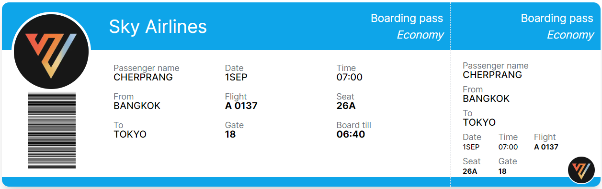

# Requirement
- Fix bug
  - แก้ input field ที่ไม่ทำงานเพราะ input id ไม่ตรงกับ key ของ formDate
  - แก้จอ scroll ลงมาไม่ได้เวลาที่ content มันยาวเลยขอบจอแล้ว ด้วยการเอา height: 100vh ออก ใน css container

- Print avg time to console
  - แสดงผลในหน้า web แทนการแสดงแค่ใน console
  - ถ้ายังไม่ landing ไม่เอามาคำนวณ
  - bkk -> tokyo ไม่เหมือนกับ bangkok -> tokyo เพราะไม่ได้ handle รายละเอียดเรื่องชื่อสนามบิน (Case sensitive)

# Extra
  - ไม่ได้ Optimize avg O(1)
  - refactor coed/project structure เช่น แยกไฟล์ LogForm ออกเป็น ArrivalForm - DepartureForm , ปรับ flight log structure ให้เขียนโค้ดได้ง่ายขึ้น

# Challenge
  - Refactor Code : Done
  - CSS : Not Done, ทำไปเพียงเล็กน้อย
  - ทำให้ product สมบูรณ์ขึ้น:
    - แก้ UX ที่ให้input timestamp เปลี่ยนเป็น input date time แทน , เพิ่ม input ที่จำเป็น พร้อมใส่เครื่องหมายให้เห็นว่า field ไหน require บ้าง
    - เพิ่ม feature validate input

# Boarding Pass
